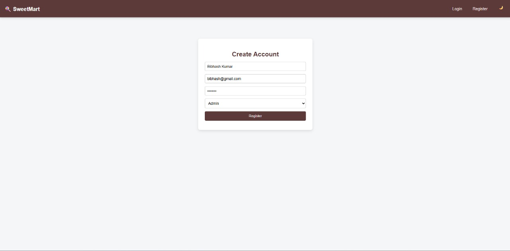
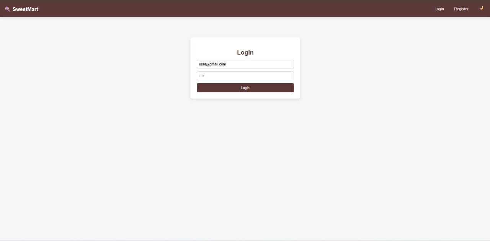
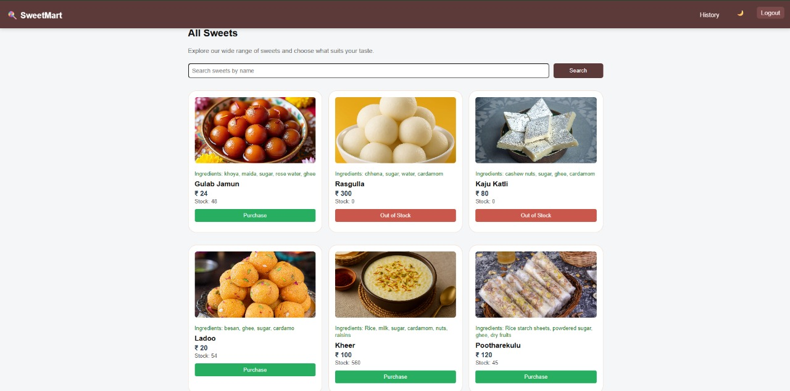
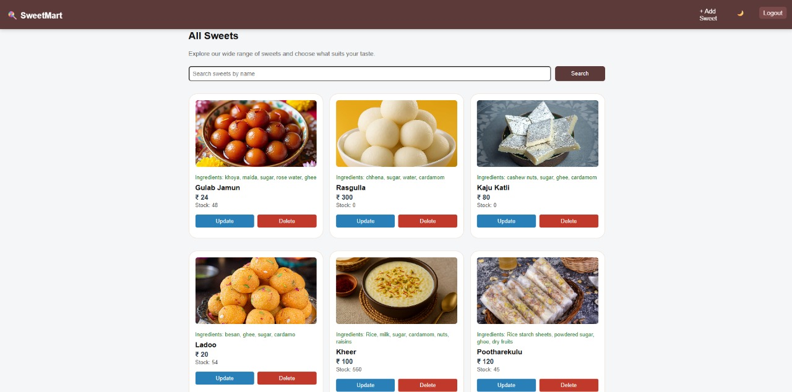
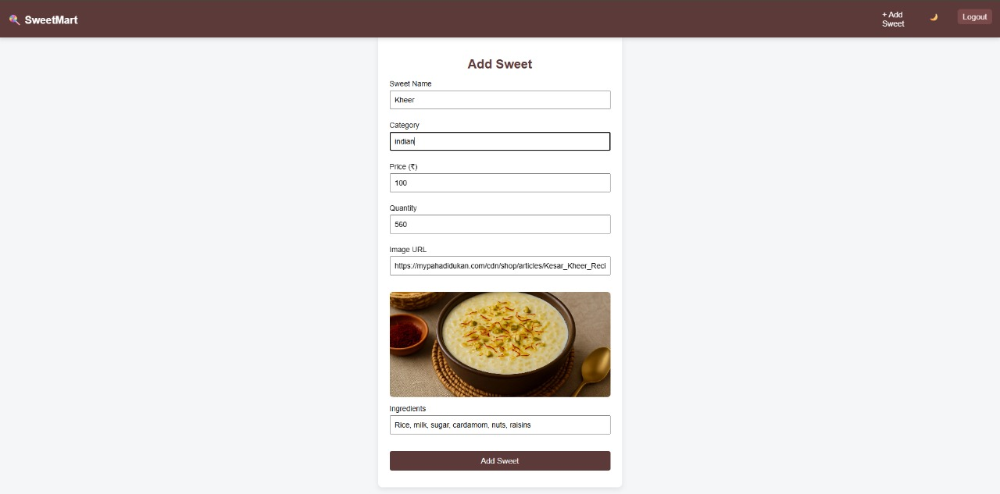
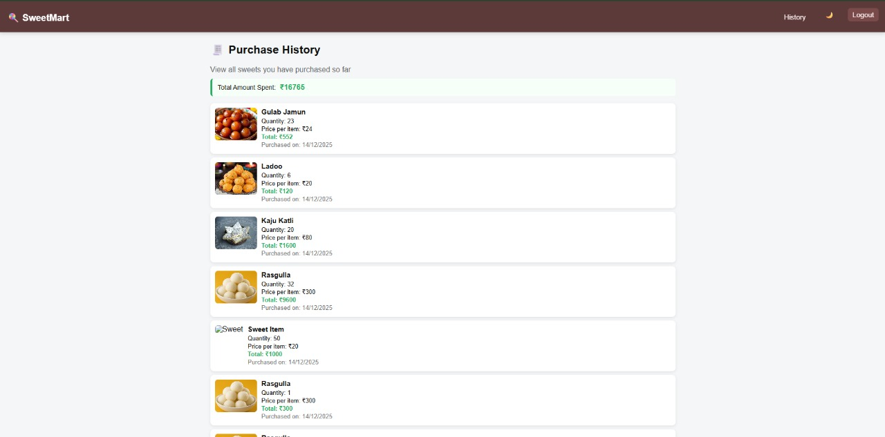

# 🍬 Sweet Shop Management System

A **role-based Sweet Shop Management System** built using the **MERN Stack**. This application allows users to browse, search, and purchase sweets, while admins manage inventory through secure, authenticated APIs.

---

## 🚀 Project Overview

The **Sweet Shop Management System** is a full-stack web application designed to demonstrate:

* 🔐 Role-based authentication (**User / Admin**)
* 🛡️ Secure REST APIs using **JWT**
* 🔄 Real-world **CRUD** operations
* 📦 Inventory management & purchase tracking
* 🎨 Clean **React** frontend with modern UI

> This project is built as part of a **technical assessment (AI Kata style)** focusing on backend quality, scalable design, and TDD-ready architecture.

---

## 👤 User Roles & Permissions

### 👤 User (Customer)

* Register & Login
* View all available sweets
* Search sweets by name
* Purchase sweets with quantity selection
* View **purchase history** with total amount spent
* ❌ Cannot add, update, or delete sweets

### 🧑‍💼 Admin

* Login with admin role
* Add new sweets to inventory
* Update sweet **price & quantity**
* Delete sweets
* Restock inventory
* View all purchase records *(backend-ready)*

---

## 🔑 Authentication & Security

* Passwords hashed using **bcrypt**
* Authentication handled using **JWT (JSON Web Tokens)**
* Protected routes using middleware
* Role-based access control (**Admin-only APIs**)

---

## 🛠️ Tech Stack

### Frontend

* React.js
* React Router
* Axios
* React Toastify
* Custom CSS (modern, clean UI)

### Backend

* Node.js
* Express.js
* MongoDB + Mongoose
* JWT Authentication
* bcrypt

### Tools

* Postman (API testing)
* Git & GitHub
* npm

---

## 📁 Project Structure (Backend)

```bash
backend/
├── controllers/
│   ├── authController.js
│   ├── sweetController.js
│   └── purchaseController.js
├── models/
│   ├── User.js
│   ├── Sweet.js
│   └── Purchase.js
├── routes/
│   ├── authRoutes.js
│   ├── sweetRoutes.js
│   └── purchaseRoutes.js
├── middleware/
│   ├── auth.js
│   └── admin.js
├── server.js
└── package.json
```

---

## 🔄 API Overview

### 🔐 Auth APIs

* `POST /auth/register` – Register user
* `POST /auth/login` – Login user
* `GET /auth/me` – Get logged-in user *(protected)*

### 🍭 Sweet APIs

* `GET /sweets` – Get all sweets
* `GET /sweets/search?name=` – Search sweets by name
* `POST /sweets` – Add sweet *(Admin)*
* `PUT /sweets/:id` – Update sweet *(Admin)*
* `DELETE /sweets/:id` – Delete sweet *(Admin)*
* `POST /sweets/:id/purchase` – Purchase sweet *(User)*

### 🧾 Purchase History APIs

* `GET /purchases/my` – User purchase history
* `GET /purchases/all` – Admin view *(optional)*

---

## 🧾 Purchase History Feature

* Automatically records every purchase
* Stores:

  * User
  * Sweet
  * Quantity
  * Price per item
  * Total amount
  * Purchase date
* Users can view **total amount spent**
* Clean UI with **green-highlighted monetary values**

---

## 🧪 Test-Driven Development (TDD)

This project follows **TDD principles** for backend logic:

**TDD Flow**

1. 🔴 Red – Write failing test first
2. 🟢 Green – Implement minimal logic to pass test
3. 🔵 Refactor – Improve code without breaking tests

4. ### 3️⃣ Home Page


### 5️⃣ Register Page



### 6️⃣ User Login



> Due to time constraints, core APIs were prioritized. TDD structure is prepared for future extension.

---

## ⚙️ Setup Instructions

### 🔧 Backend Setup

```bash
cd backend
npm install
npm run dev
```

Create a `.env` file:

```env
PORT=5000
MONGO_URI=your_mongodb_url
JWT_SECRET=your_secret_key
```

### 🎨 Frontend Setup

```bash
cd frontend
npm install
npm start
```

---

## 🌟 UI Highlights

* Sticky navbar
* Role-based navigation
* Admin-only actions hidden from users
* Smooth purchase flow (no disruptive popups)
* Clean, interview-friendly UI
* Responsive layout

---

## 📸 Screenshots (Application Flow)

> **Add these images to a `screenshots/` folder in your repo and update paths if needed.**

### 3️⃣ Home Page


### 5️⃣ Register Page


### 6️⃣ User Login


### 7 User Perchase



### 2️⃣ Admin Views Sweets 



### 1️⃣ Admin Add Sweets



### 4️⃣ Perchase History




> 📌 **Sequence:** Login as User → Purchase → History → Login as Admin → Add/Update Sweets → View Updated Inventory

---

## 👨‍💻 Author

**Bibhash Kumar**
MERN Stack Developer

🎓 B.Tech – Computer Science & Engineering
🏫 Chandigarh University

* 💼 GitHub: [https://github.com/bibhashkumar45](https://github.com/bibhashkumar45)
* 🔗 LinkedIn: [https://www.linkedin.com/in/bibhash4587/](https://www.linkedin.com/in/bibhash4587/)

---

⭐ If you like this project, don’t forget to **star the repository**!
